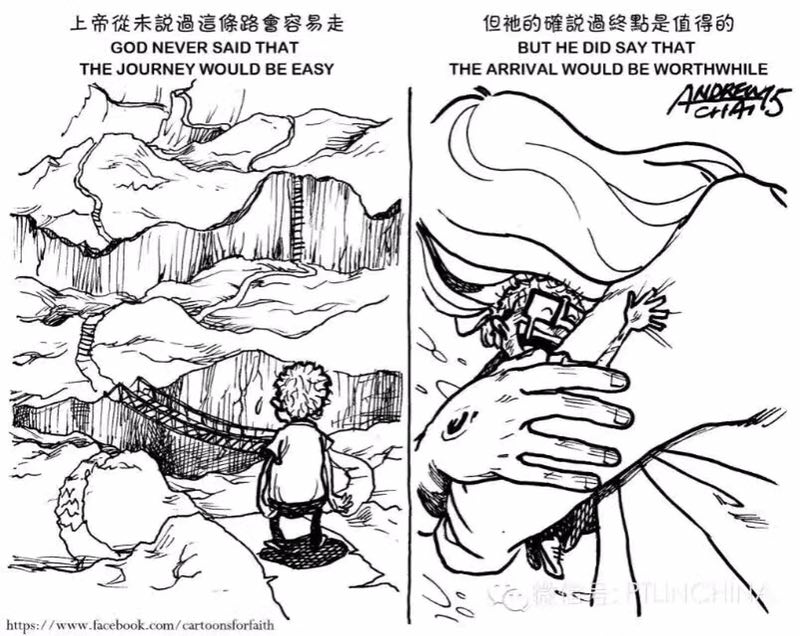
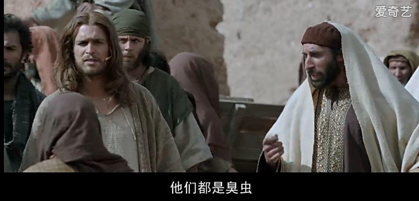
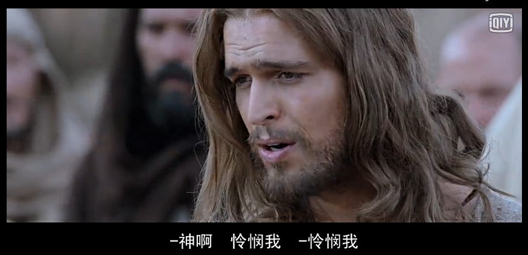
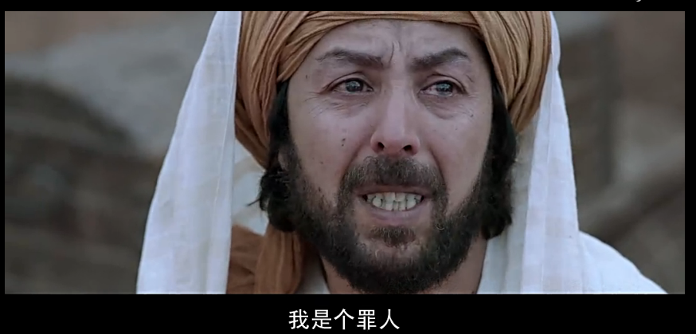
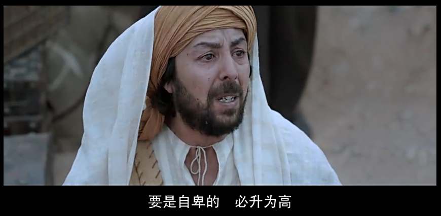

[TOC]

-----------------------------------------------------------------------------------------------------

### 同行者灵修笔记

#### 21/1 出3

触动经文：摩西对神说：「我是什么人，竟能去见法老，将以色列人从埃及领出来呢？」神说：「我必与你同在；.....」

因为会经常思考自己的身份而纠结选择，就是因为很多时候凭着自己的力量去做事而忘记自己的安慰是来自于神。

观察：一日，外出放羊的摩西看见异象。神从荆棘火中出来，让摩西带领以色列脱离埃及人的辖制，到流奶与蜜之地。摩西怀疑自己，神安抚摩西，让他明白旨意来自他必成与他。

教训（神是一位怎么样的神？）：慈爱，会心疼自己选民的，时刻看顾着以色列民，会呼召领袖来完成拯救的工作（？是不是人们会忘记神恩才会一而再陷入这样的循环）。安慰者，这时候的摩西对自身以及以色列人都没有信心，但神会让他明白我就是你的神，一直与你同在。

反思：生活中，很多时候想过着基督里的生活，往往不能如愿。有时候像唱片一样，经常反面。

应用：相信神，`时刻`明白他的同在。

祷告：天父，孩子生活中会有不顺服，会抢走主导权，会质疑你和自己的身份，求你帮助孩子明白你和深知你的同在。

#### 22/1 出4

触动经文：摩西对耶和华说：「主啊，我素日不是能言的人，就是从你对仆人说话以后，也是这样，我本是拙口笨舌的。」

同样，在出三中看到摩西会推脱拯救这个工作，但是这里的推脱变得具体，看出了摩西其实还是没有底但是有点想解决问题的态度，可是后面依旧否定了自己看出这里其实更多依旧是逃避拯救工作。

观察：神教摩西三个神迹让以色列人相信摩西，之后摩西依旧犹豫自己是不能将话说明白的人。这时候神对摩西发了第一次怒气，并安排亚伦来帮助摩西的拯救工作。于是，摩西离开岳父那里回到埃及，亚伦迎接他。可是路上神为什么要杀他这件事不是很明白，而他妻子这样的行为却免了击杀也不是很明白。

教训（神是一位怎么样的神？）：有怒气的神，神完全可以控制摩西的想法首先没有这么做，其次，这里发怒并不是摩西不愿意去而发怒，更像是你根本不是很相信我的一种怒气。

反思：神往往愿意使用那些不是很好的人，因为这样才能让更多不足的人明白，神的爱的伟大。可有一个问题是，说我们的神是抬举贫寒人的，那怎么解释相对富裕的人呢？神对摩西说的话，其实更多是安慰摩西，让他真明白我与你同在的。

应用：主权交托吧，更多时候不相信是因为自己会有自己看事情的角度去看自己，从而否定了自己。

祷告：天父，帮助孩子对主权变化的情况变得敏感点，从而更自己到底是凭着什么生活。

#### 23/1 出5-6

触动经文：摩西回到耶和华那里，说：「主啊，你为什么苦待这百姓呢？为什么打发我去呢？自从我去建法老，奉你的名说话，他就苦待这百姓，你一点也没有拯救他们。」

摩西已经去找过法老，却得到不是很顺利的结果。当然他想可能是这一切都是神安排的顺顺利利，可是结果出现问题的时候，他还是会怀疑自己，可以看出这时候的摩西不明白神说的话或者是忘记神之前说会让法老的心刚硬这话。

触动经文：摩西将这话告诉以色列人，只是他们因苦工愁烦，不肯听他的话。

摩西讲拯救的事情告诉以色列人，但是以色列人不听。而我们生活中也是这样，我们会将自己献给劳苦里面，不愿意留出一点点时间与神交流，时间久了会变成道理都懂却不能行的窘境。

观察：摩西和亚伦都去见过法老，跟他说遇见神并且要求法老让以色列民出旷野守节。但法老不认识神，认为以色列民懒惰还有时间去守节，变增大了劳力的难度。以色列人哀求法老得到同样的回复，遇见摩西、亚伦抱怨他们所行的事情。摩西再一次跟主说话为什么是我？怀疑主到底想不想拯救他们。神之后让他明白，他是会拯救的，并且领以色列人出来的就是摩西和亚伦。

教训（神是一位怎么样的神？）：不轻易发怒气的，安慰者。目前为止，神只向摩西发了一次怒气，即使现在摩西还会说自己是一个「拙口笨舌」的人，并怀疑神到底拯不拯救他们，神这时候没有发怒，而安慰摩西他看到了以色列人的处境，我会带领你们出来的。

反思：我们确实会希望神安排好的事情或者祈求的事情是很顺利的，可现实经常不是那么顺利，在那么的一刻会伤心甚至怀疑为什么。接着就是不愿意继续做下去。那么今天的摩西也同样抱怨、质疑，可他还是按照神的指示行了出来，这一点还是要学习的。

应用：即使事情不是那么顺利，依旧要怀着信心继续做下去。

祷告：天父，求你保守孩子的心，在那些失落里同样深信你依旧爱着我，让我还能继续笑着行下去的信心。

#### 24/1 回顾前三天灵修内容

前三那天的都经文都是涉及摩西被神呼召的事情。最多的思考是，被呼召是不是一件很好的事情。如果被呼召的是自己，真的会考虑很多事情，有好多想去做却没有机会去做的事情以及好多事情没有做之类的。那么就涉及到自己是不是一个顺服的人？不是，因为很多时候会凭借自己的能力去解决的，会用自己的方法去衡量是非对错，很多时候对神不是很信靠，心中会有一定的小九九在哪里说话，所以摩西确实是一个榜样，神呼召之后他立刻去做了即使他会有抱怨的时候，可每当要抱怨的时候，他会选择退到神那里与他去诉说自己的不足。那自己也是希望能这样的顺服，愿意摆上自己，可是会被环境、以及环境里的人干扰，觉得怎么要在正值年华时候去过上暮时的生活，还会把真理与生活脱节。昨天看到廖师傅的灵修看到一句「退到神那里，是最好的选择，也是唯一的选择」，很多时候自己愿意去找别人去寻求答案，如果不符合心意可能会换另一个，而从不会认为天父是我们最好的挚友，他明白我的心意，也能满足我的心意。所以，这几天灵修中，更多的感触是要多多思考生活中很多时候与神之间的关系。

#### 25/1 出14

触动经文：摩西对百姓说：「...耶和华必为你们争战，你们只管静默，不要作声。」

很多时候，我们会选择用自己的那一套评判标准去为自己申诉，真的不明白神每一件事情都为着你争战。

观察：神让以色列人过红海，但是再之前还是要安营在海边。神使法老的心刚硬，在来追回以色列民。百姓见法老的兵丁近的时候，开始向神哀求并不相信摩西并发怨言。摩西安抚百姓说「耶和华必为你们争战」。第二天一早开始过红海，神让以色列民走过了海中的旱地而当埃及人下到海后，神使兵丁混乱、使水回流淹没了他们。百姓见神的神迹又信服他和他的仆人摩西。

教训（神是一位怎么样的神？）：全知，感觉并不会一次性将话说完的神。15-18节中，之前摩西就像百姓一样有哀求，这时候才会告诉摩西之后该怎么做。仿佛是操练摩西时时转向他一样。

反思：其实神为什么不让以色列民直接过红海而又要法老来追呢？从事情的经过来看，这时候的百姓的信心不是那么坚定，从后面看见追兵可得，这样做的结果就是让百姓`又`信服他和他的仆人。

看到有一点很重要，摩西也会跟着百姓一样哀求，但是这时候他有一次有了难处转向了神而不是靠自己的才能。

应用：一有难处就转向神    OS：「真的好难」

祈祷：让我时刻明白转向你的重要性，也让我明白更多的时间与你相交。

#### 26/1 出18:1-12

1-2节
【问】是什么让摩西的岳父叶忒罗带着摩西的妻儿来？（提示：连接词“便”）带摩西的妻儿来可能是什么意思？
【我的答】 听见神为摩西和神的百姓以色列所行的一切事，便带着摩西的妻儿来了。信任摩西的这位神。
【我的应用】对神的作为只要有反应的，能看到行动的那种
【我的祷告】天父，帮助我能看见你的作为，让自己有坚定的反应并且能够有所行动，而不是光看而不行

7-8节
【问】叶忒罗来了，摩西是怎么接待的？摩西跟他说了什么？（提示，程度词“都”）

【我的答】 下拜、亲嘴、问安，「将耶和华为以色列的缘故向法老和埃及人所行的一切事，以及路上所遭遇的一切艰难，并耶和华怎样搭救他们，都述说与岳父听」
【我的应用】要热情的招待到我这里的一切人，要乐意去与别人毫无保留的分享主在自己身上的作为分享给别人听
【我的祷告】天父，你明白我会总会去害怕的迈出第一步，求你帮助我每一次都勇敢的走出第一步去而不是看别人的作为而去选择是否分享，让我尽自己的本分去行事。

9-12【问】叶忒罗听见，是什么心情？他是如何称颂神的？他还做了什么？

【我的答】一种喜悦并相信耶和华神的感觉。叶忒罗献燔祭和平安祭给神。
【我的祷告】天父，孩子在家中并不是一个好榜样，求你帮助家中灵里软弱的，让他变得刚强，明白平安与喜乐都是来自与你那里，求你看护保守本家。

#### 27/1 出18:13-27

触动经文：这样，你就轻省些，他们也可以同当此任。

觉得岳父好聪明。回想更多的是团契中，自己会不相信其他同工，怕做不好而自己一人就去出。那问题来我一个人也未必好呢？这时候我一定会很跟别人比较说至少比别人好。

教训（神是一位怎么样的神？）：体贴人的神，「你若这样行，神也这样吩咐你，你就能受得住，这百姓也都平平安安回他们的住处」。一天下来如果只是摩西一个人去审判以及教训和指示百姓，摩西会累死吧。神体贴他，允许他这样做有其余有才能的人帮助他。所以神应该更喜欢一群人去做事吧，毕竟一个人会累会软弱。

反思：为什么自己在团契的时候会选择一个人去做事情呢？更多会去考虑事情而不是人，会怕事情做不好而丢面子吗？还是就是偏执呢？我觉得都有吧。可这样确实会很累，更多还是要相信。

应用：找好自己的定位，不要像消防员一样那里起火就往那里钻。

祈祷：天父，安抚孩子的内心，让孩子真的明白成事是在于你，也求你帮助孩子一直都会积极的与人分享，让自己按下性子来，侍工的时候更多看重的是人而不是做好这件事情。

#### 28/1 回顾前三天灵修内容

我確實會有兩種不一樣的面孔：大學生活、團契生活。分別在不同的環境下，自己會有不一樣的心思意念，確實會存在很多的小九九。別人得罪了自己一定會很較真，無論是非對錯。可，我深知不應該這樣，每次營會結束我才發現自己會有克制一段時間，之後會覺得很累有變回老樣子了。但，總結這三天的經文來說，神是我的幫助者，為什麼我總要去跟別人較真呢？我會有吃虧以及不甘心不願意示弱在我裏面，但神是我唯一的依靠和幫助，說實話生活中我會去憑藉己力去行事，一方面因為我是怕麻煩別人的人甚至怕麻煩神，而二方面為爭一口氣在裏面。

祈禱：天父，求你安撫孩子的内心，幫助孩子將自己的主權能夠正真的擺上、無時無刻的擺上，讓自己有機會以及心思意念去思考你與我同在這件事，讓我有寬恕的心，讓我不要與他人一味的爭強。

我還是一個不原意去相信別人的呢！解釋一下，我是會怕交待給別人的事情做不好，為什麼怕？這人在我影響中留下不好的形象。所以這種情況下，我一般都會同時準備一個B計畫來彌補事情突發狀況。因為上面的原因，長此以往就都準備補救計畫，會對很多人包括團契中的DXJM有時候會不耐心，而更多願意一個人去做。可，神的心意告訴我確實他不願意一個人去撐起整個侍工，況且一個人有限的會有自己不自信的時候，所以會有亞倫去幫助摩西。

祈禱：天父，求你幫助還孩子放下自己的己見，不要有驕傲的心、傲慢的嘴，讓還孩子樂意與別人交流，會同心的分享給別人神在我身上走過的痕跡。

#### 29/1 民11:4-17

觸動經文：他們中間的閑雜人大起貪欲的心......

經文是出現在走曠野、吃嗎哪的時候，人會不只是滿足於現有的嗎哪，此處也描述了很多種嗎哪的做法，可中間總會有「閑雜人」對這樣的生活不滿足。為什麼是閑雜人大起貪欲？會比較，跟以前埃及的生活以及現有的生活比較，從而覺得為什麼現在要遭這份罪呢！映射到我的生活，其實也是一樣的，平時很忙會沒有時間去考慮很多感受，當自己閑下來思考的時候，可能就因為無聊就開始比較自己與別人的差距等，這時候就會很不甘心而引發部分的貪心說我一定要做到，從而陷入下一輪的忙碌。

觸動經文：....他們就和你同當這管百姓的重任，免得你獨自擔當。

神會體貼人的軟弱。這裡的有一個問題：神知道摩西一人承受不來，為什麼不提早就這樣安排讓摩西少點負擔呢？

觸動經文：民11:12

在主日學帶孩子的時候，我才發現自己越來越愛管「閒事」。很多初中的孩子動不動就打架什麼，以前我都是直接解決的，現在我和他們一起去思考怎麼回事以及事情的結果會是什麼了？其實很多時候，我也不想的畢竟一天下來很累，可是總會有那樣的心思在哪裡說時間不多了，還是挺挺教教他們吧。

教训（神是一位怎么样的神？）：體貼的神，這裡摩西同樣會抱怨一人承受不來，神這裡是直接對摩西找70個幫手一同擋這個重任。

反思：為什麼會總會其貪心這個念頭？就是不滿足與現狀，很多時候被別人說你好有「上進心」，好像其實「上進心」算是「貪心」的前身吧，當自己要變態到折磨自己去爭取世上的各種名獲利的時候，這時候「上進心」已經進化為「貪心」。那為什麼我們會不滿足與現狀呢？攀比、奮鬥的理由...，自己會比較不同時間段的自己，以及更多厲害的人物，並且現在的社會比你小的人都比你厲害的時候，自己會有一些焦慮在裏面，覺得不努力真的太差勁了...但這一切的焦點都是在整個世界上了，並沒有向摩西一樣有困難轉向神，好像忘記了自己的誰。

应用：感覺到有情欲的時候就要轉向神，明白自己在基督裏的價值，不要被世界影響太長了。

祈禱：天父，求你讓孩子明白自己的軟弱，不要讓自己一人去逞強的承擔，安撫孩子內心，讓我深知你會為我預備最適合我的道路，求你讓我堅信下去。

#### 30/1 民11:18-35

24-26节：疑惑的地方是「他們就受感說話，以後卻沒有再說」，為什麼靈停在他們身上之後卻沒有再說話？可是營中的「伊利达」和「米达」没有去会幕前却可以有灵停在他们身上。并且说这两人都是被录的人，但没有去，可不是说有70人了吗？

反思：之后没有再说这件事情，是信心的问题吗？但作为长老的70人也会有这样的问题，更何况那些闲下有贪欲之心的人呢？让我能想到的一件事情就是，信心确实很难坚固的，可走这条路的必备的条件也就是信心了。

祈祷：天父，求你赐给孩子一颗明白真理，相信真理的心，不要让我凭着自己的感受去衡量这个信仰跟我之间的关系。让我能更多去思想你。

18-20、32-33节：不是说好让以色列人吃一个月的肉吗？让他们吃到吐吗？但是，之后却发生了变故，神直接用「最重的灾殃击杀了他们」，这到底又为什么呢？并且感觉这一次有很多人死掉。他们死于自己的贪欲，突然感觉这件事情有点恐怖了，因为自己生活中也会抱怨一些事情那我也会不会有这样的结局呢？

反思：以色列人生活改变过后接受不了开始埋怨神的为什么引他们出去！让我想的更多的是：应该是顺服神的安排，可是说的真的好容易，当事情临到我的时候，说实话我不一定能顺服下来。

祈祷：天父，很抱歉孩子会较真与自己的选择，会走很多弯路，你也晓得孩子的性格，请你安抚孩子的心灵，不要太较真自己的事情，也不要老想着该自己该怎么做才能少走弯路，孩子愿意顺服在你的宝座旁，也愿意将自己自己的主权完全交托与你，求你帮助我，求圣灵在我心中做工，使我愿意的意思能够渐渐的行出来，阿门。

此刻状态：有点疲惫。

#### 31/1 民12 补

触动经文：...「难道耶和华单于摩西说话，不也与我们说话吗？」.....

反思：这里是米利暗因为摩西娶了古实女子毁谤摩西说的话，这里的有一个大前提是他们是姐弟关系都会有毁谤自己兄弟的情况，更何况我们？平时生活中，我们也会因一些自己不接受的事情，去背后议论DXJM。

祈祷：天父，看顾孩子的心思意念，帮助孩子去做一个和睦DXJM的人而不是离散的人。孩子也会有不接受的时候，但求你让我明白每一人的一言一行都是出于你的安排，让孩子有心去接纳自己和身边每一个人的不足，使我明白出于爱也成全于爱。

教训（神是一位怎么样的神？）：教导孩子彼此相爱、使人和睦的神（虽然直接让米利暗立即得大麻风现在在我看来是不是有点严酷）。耶和华不允许只对摩西说话这件事情而嫉妒诽谤摩西，却忘记摩西是尽忠的。

反思：细想为什么会这样？经文说道摩西娶妻这件事情，但从话语中看出仅仅是神对摩西是直接说话而不用谜语之类的。更多是出于嫉妒，因为米利暗他们接受的想必就是谜语。时间久了，大家会忘记摩西前期是多么的辛苦、多么的挣扎，曾经也是会抱怨、推托这件事情，但是他每一次都是选择是转向神和祈求神。所以大家时间久了很容易让我们忘记一些本不应该忘记的事情，所以为什么在约书亚记中过河要立石为记。好像就是因为前因，我们很容易产生不公平、不甘心之类的情绪。

祈祷：天父，孩子更多时候有情绪的出来的时候，我会忘记耶稣早已为我这样的死这件事情，会忘记你是多么爱我这一件事情，求你帮助我牢记你每一日在我身上的恩典和同在，也让孩子让其他DXJM看到时，让他也同时明白你是多么的宝贵，你是多么的爱他，阿门。

此刻状态：清醒、Happy，因为刷了昨晚留下的知乎，这是第一次补的灵修所以多少心里会有一点点内疚，😄哈哈，希望以后会没有这点点的内疚。

#### 01/2 回顾前三天的灵修

💡其实有一个疑问：为什么闲杂人会起贪欲这件事情？不会就因为「太闲」吧😪

其实回顾一次灵修内容，我发现神还是蛮严厉的。确实以色列人会时不时抱怨神，每一次神都会派摩西说话。可是为什么这几次就要惩罚？在我的观点是「想必他老人家也忍了好久，为什么你们不能像你们列祖亚伯拉罕一样呢？」

回想到自己，那一刻会有一丝的惧怕。我这么逞强，我这么每次被逼的走投无路才来想到你，你会不会也忍我了好久呀😰，会不会那一天我惹怒了你，也会被除去。

「一个人能都很快，却不能走远」，就像歌唱的一样，确实很难走，为什么小时候并不会觉得呢？其实，神也想到这事，也不选择让这重担让摩西一人承受。很多时候，我会看不上其他人，觉得自己很OK的，可是去年一年让我回顾的时候，我一个人的时候会很情绪化，久了会有厌恶他人的情绪出来，所以「立杰呀，不要再一个人了」

我记得廖师傅那一天有这样一个问题「身边有些含金汤匙出生的DXJM，你会祝福他们吗？」会祝福，但我同时会有抱怨或是嫉妒出来的，这时候还真分不清是那一个亦或者两个都有。让我想到就是「伊利达」和「米达」，没有去会幕但仍旧说语言，这时候约书亚会嫉妒，可摩西却是「开心」的，他希望每一个人将这份重担都落在心中。

祈祷：天父，你看顾孩子在地上的生活，让孩子能有足够的耐心在你里面，让我能放开自己，接纳自己的不足，时刻明白你早已肯定了我。

此刻状态：😄，终于没有去拜年了，开始放寒假咯！、

#### 02/2 民14:1-10

触动经文：众人彼此说「我们不如立一个首领，回埃及去吧！」

反思：因为前面有12探子的来报，让以色列人有一次陷入了慌张，开始害怕迦南人是实力从而再次追溯抱怨自己为什么出来！仿佛有了一个套路，遇见不爽的事情——>埋怨领袖——>埋怨神——>为什么要出埃及。是不是这样就说明还是那个问题，人是太容易忘记恩典的，太容易在患难中跌倒的呢？

但这句话，感觉说明，这时候的人不再希望是神召领袖来管制他们，他们更希望是自己选出来的领袖。这样可以说明其实大多数人还是信赖神吗？

祈祷：天父，求你帮助孩子看顾自己的心思，让我能相信你是为我着想的。帮助孩子有静下心的那一刻。

触动经文：...耶和华若喜悦我们，就必将我们领进那地，把地赐给我们...但你们不可背叛耶和华，也不要怕那地的居民，...并且荫庇他们的已经离开他们，耶和华与我们同在，不要怕他们

反思：总会有清醒的人会勉励大家。可有一个问题是：怎么看待这里的「背叛」？他们抱怨好像不算是背叛，所以神不是那么严格到你一抱怨我就不认你，他仿佛知道人抱怨是常态，更看重的是你是怎么样的一个人吧而不会因为你那一刻怎么想而轻看或者不认了你。可我生活中，我就是会因为别人的一刻的言辞或行为而看不起了别人😪。

祈祷：天父，帮助孩子能不凭自己的眼界去论断别人，让孩子学会去接纳更多的东西，教导孩子的品性，让捋顺它。

此刻状态：😞，今天玩了一天的王者荣耀，原本想coding的这件事情都一直拖延。

#### 03/2 民14:11-25

触动经文：...求你照你的大慈爱赦免这百姓的罪孽，好像你从埃及到如今常赦免他们一样..

反思：百姓是不是抱怨，而摩西从埃及阶段也有跟着抱怨，但是现今的他明白了，开始为着这些无知百姓向神祈求赦免。跨过千年后的耶稣也同样为全人类向神祈求。这里看到了一个领袖的成长，也看到神愤怒的样子😰。

祈祷：天父，孩子会有不明白真理的时候，会有对你的话质疑背叛的时候，甚至会有惹怒你的时候，我知道这样是不对的，求你赦免我，帮我更爱你。

触动经文：

..这百姓要藐视我要到几时呢？我在他们中间行了这一切神迹，他们还不信我要到几时呢？...

..这些人虽看见我的荣耀和我在埃及与旷野所行的神迹，仍然试探我这十次，不听从我的话，他们断不得看见我向他们祖宗所起誓应许之地。凡藐视我的，一个也不得看见...

教训（神是一位怎么样的神？）：爱人、严厉的神。这时候看到神会有怒气出来，因为都给百姓看到了一次有一次的神迹，而很多百姓会忘记，并且会有贪心出来；更多的时候应该把神当作了获取的工具，可更严重的时候，百姓连求都不求，就干抱怨看神会不会给的心态。

神一次又一次的行神迹，让百姓信靠Ta是神，白天云柱夜间火柱的庇护他们，他们却一而再，再而三的试探神，最后神还是不愿意让这一批原本能及早到达的迦南的进去。

反思：我有没有把神当作了工具亦或者是爱理不理，要神理我呢？有，因为自己是很要强的人，即使是神很多时候一不小心就成了自己的 奴仆了🙈，甚至有时候会去抱怨😰。

祈求：天父，孩子明白这一些是罪，求你赦免，让我能渐渐明白你的话，让我能够牢记你的恩典，看顾孩子的每一天的光阴。

此刻心情：😄，今晚终于coding了，即使半天没做出啥来，至少少玩了王者荣耀！

#### 04/2 出32

触动经文：亚伦从`他们`手里接过来，铸了一只牛犊，用雕刻的器具作成。`他们`就说：「以色列啊，这是领你出埃及地的神。」

反思：`他们`是谁？第一个是以色列百姓，第二个我原想是亚伦这班造牛犊的人，但5节「亚伦看见，就在牛犊面前驻坛」，这里的他们也该是以色列百姓。这里其实看到一点心酸，以色列百姓从埃及到旷野经历了这么多，仍旧不认识神，铸了一个金牛犊就在哪里当作拯救他们的神。有个问题出来：在经历很多神的保守，有没有却给自己立假神在哪里拜，还安慰自己说这就是一直保守自己的神？

会有吧，这种情况自己应该是很软弱的时候，会去凭着眼界去思考事情。而这里的百姓会不会因为有段时间没有人带领他们与神相交，而选择这样做呢。经文中只能说明摩西去了西奈山40天，而百姓因为摩西的不归而选择这样做。

祈求：天父，求你帮助孩子的软弱，帮助孩子长时间一个人的时候，也不要忘记你的同在，让自己花精力与你相交，看顾那些孤身软弱的DXJM，让他们也明白你看顾他们。

触动经文：耶和华对摩西说：「谁得罪我，我就从我的册上涂抹岁的名，..我的使者必在你前面引路...只是我追讨的日子，我必追讨他们的罪。」

教训（神是一位怎么样的神？）：严厉、慈爱的神，神都有怒气了因摩西的祈求也没有除去百姓，但说了一句蛮重的话，即使百姓都惹怒了神，但神仍旧让他的使者在百姓前面引路，神仍旧还是会看顾这一群百姓。让我想到「上帝未死1」中痴呆的夫人对儿子说的那些话：「有时候，魔鬼允许人们无忧无虑的生活。是因为它不希望人们转向神。你的罪像牢房 除此之外都很美好、舒适，而且似乎没有任何必要离开。大门敞开的，有一天时候将到，窄们猛一关，突然..为时已晚。」

祈求：天父，赦免孩子的罪，孩子还是会有很多小九九，可能会因为想太多而去怀疑你，求你让孩子能日渐的明白你，求你看顾孩子在世每一天都能察觉到你的同在。

一个小问题：摩西去求神不要除去以色列人了，为什么自己还要带领利未人去杀人呢？

#### 05/2 回顾前三天的灵修

即使见过神迹、见过神荣光的以色列百姓，在难处、孤身时候都会软弱。这告诉了我，软弱其实才是人生的常态，但是常态中也要保持着这份信心。那么如何保持这份信心呢？经文中的例子🌰是要有一个属灵领袖。但是我怎么感觉这次回顾的感觉和上一次总结一样，会有担心😰在里面。回想自己确实经常陷在情绪当中，不知道为什么那时候会呆在情绪当中而不是选择转向神。

祈求：天父，帮助还自己时常想着你的话语，让孩子不要想太多😩，像孩子一样在你面前，阿门。

此刻状态：😕，不知道该怎么描述了。这时候的表情。

#### 06/2 民16

触动经文：摩西有对可拉说：「利未的子孙哪，你们听我说：以色列的神从以色列会中将你们分别出来，使你们亲近，办耶和华帐幕的事，并站在会众面前替他们当差。耶和华又使你和你一切弟兄利未的子孙一同亲近他，这岂是小事？你们还要求祭司的 职任吗？...」

反思：人会有贪心，这份的贪欲如果真的不明白满足来自于神的话，在每一个阶段都会有贪心出来。可拉是被选入会中的一人，有了一定的名望，并且还是利未人办理耶和华帐幕事的人。仿佛就是不满足，看到上头还有领袖的时候，召集他人一同攻击领袖。便有一个问题：「你会贪心？那现在呢？该怎么去做？」我会，`因为觉得年轻所以会将这份贪心转为上进心当作向上的动力`，现在可能我还是会有贪心在里面，可我真想无时无刻的明白圣经的话语晓得在神面前早已经得到了满足。可是每一次都是事后才意识到自己这一刻贪心了。很多时候，真的只会看着眼前的好处而不去辨别自己是否贪心了。突然觉得，自己这么差劲的人，神却依旧爱我，明明应该很开心的事情，自己去却很伤心。

教训（神是一位怎么样的神？）：公义的神，百姓真的这样了，神真的不止一两次有要击杀这一切百姓的的怒气了。

反思：即使百姓攻击摩西和亚伦，神要击杀百姓，他们没有攻击别人，反而在祈求神饶恕他们，为他们赎罪。

祈求：让孩子不要太逼自己那么上进，让孩子及心甘乐意的将自己的主权交托在你的手中，安抚孩子的性子，不要伤害到身边亲近的人，保守孩子的心。

问题：为什么人们会这样？难道就因为始祖的犯罪，罪就入了世界，让人心会不断的变化。都不敢想神起初造的人们是多么好的样子。

#### 07/2 民21:4-9

触动经文：百姓到摩西那里说：「我们怨 讟耶和华和你，有罪了，求你祷告耶和华叫这些蛇离开我们。」

反思：`百姓`之前却是会抱怨这一切的环境不好，以前的他们一直抱怨，但是这次他们遭到苦难的时候，他们开始意识到自己之前的行为了，他们主动的到摩西那里，让摩西帮他们祷告神。这一转变真的感动吧。摩西看到百姓这样的回转应该会很开心吧。感恩那些一直都相信着自己的人，他们始终相信你会回转回来，即使时间很长。

祈求：天父，不要刚硬孩子对别人的心，孩子真的会很容易不给别人第二次机会，可是我这么差劲的时候，你都时刻等着我回转的那一天，我知道这样会很难，自己会挣扎，可孩子真的很容易去慢慢放开自己执念，接纳别人的不足，求你看顾我阿门。

#### 08/2 申34

​    触动经文：耶和华对他说：「这就是我向亚伯拉罕、以撒、雅各起誓应许之地，说：「我必将这地赐给你的后裔。现在我是你眼睛看见了，你却不得过到那里去。」于是，耶和华的仆人摩西死在摩押地，正如耶和华所说的。耶和华将他埋葬在摩押地、伯毗珥对面的谷中、只是今日没有人知道他的坟墓。」

教训（神是一位怎么样的神？）：守信的神。耶和华一直都没有忘记将以色列人带到迦南地。只是时间太久了，同样的神也让摩西这位领袖应了当初的应许「能见却不能入」。在世界的观点，确实会觉得摩西其实还有资格进去。并且摩西确实耶和华埋葬的，这一点足以说明摩西与神的关系很亲密。而在神的眼中，这确实不允许的。会觉得一点可惜。

祈求：天父，求你帮助孩子经常会想到你的话语，孩子有时会得罪了你，求你帮助孩子对罪感到敏感，求你帮助孩子更加的亲近你。

观察：摩西死后，百姓为之哀哭了三十天。被摩西按的约书亚起来带领百姓，这时候百姓的反应确实`便听从他`，出来的行为也变了是`照着摩西吩咐摩西的行了`。最后两节，说了摩西对整个以色列中的历史唯一性，`他是耶和华面对面所认识的`

#### 09/2 申31

 触动经文：你们当刚强壮胆，不要害怕，也不要畏惧他们，因为耶和华你的神和你同在。他必不撇下你，也不丢弃你。

反思：现实是，神一直与我们同在，可我们在会怀疑他会不会与我们在一起，所以经常会害怕。但这里用了一个「必」说明神给了我们一个应许。所以我们之后的生活还有什么好怕呢？

祈祷：天父，孩子会有软弱的时候，求你帮助孩子，提醒孩子你时刻与我同在。让孩子抓住这个应许，帮助我。

触动经文：因为我将他们领进我向他们列祖起誓应许那流奶与蜜之地，他们在那里吃得饱足，身体肥胖，就比偏向别神侍奉他们，藐视我，背弃我的约。

反思：我们经常在患难中会依靠神，但面对安逸的环境下的时候，我们是忘记我们的神，自己去享受安逸的生活。

祈祷：天父，孩子不愿意自己把你当作「只能共患难，不能同享福的神」，帮助孩子更多爱你。

此刻心情：😄，开始学习双拼。

#### 10/2 回顾灵修

这四天的灵修，更多说明了人是很贪心的，会不断的去寻求更多的权利，甚至是自己不能负担的。但庆幸的是：总有人帮你祷告，可有时候反而会针对这个人。还有要明白自己的罪，要悔改，当然是要察觉到自己的罪，及时认罪。

也要学会自己一个人的时候，自己一个人也要慢慢的成长起来。但不要埋怨一个人的时候，确实别人会有很多的帮助，不要去嫉妒别人😩，不要忘记神与自己时刻同在。因为「他必不撇下你，也不丢弃你」

此刻心情：超开心😄，开始熟练使用小鹤双拼咯！！

#### 11/2 徒8:1-3  & 9:1-9

触动经文：有虔诚的人把司提反埋葬了，为他捶胸大哭。

反思：现在很多时候，不光是教会还是TQ，会抱怨怎么人这么少，该怎么办呢？其实，只要有`虔诚的基督徒`就够了。可我们在里面的人都很浮躁，有些会彼此埋怨、不信任DXJM。更多该捶胸大哭的应该是我们才对。

祈祷：天父，帮助孩子在行为、信心上都有良好的榜样，帮助孩子建立起这样的榜样，孩子骄傲的时候教导孩子，明白这一切来自于你，安抚孩子的性子，学会更加爱你。

教训(怎么样的一位神？)：不能测透的一位神，保罗原本是迫害信徒的领袖之一的人，但我们不能测透神的心意到底是什么，他选择保罗成为失去的那一位，将反面的人物反转过来，这是何等恩典。如果按照世俗的观点，我们一定不会重用原本是仇敌的人，这样的心态实在难以想象。

此刻心情：乏味，原本今晚的课推迟了，还有就是冷😰。

#### 12/2 徒 9:10-25

触动经文：主对亚拿尼亚说：「你只管去，他是我所拣选的器皿，要在外邦人和君王并以色列面前宣扬我的名。我也要指示他，为我的名必须受许多的苦难。」

反思：这时候，保罗在大家的心中还是一个`逼迫他们（相信耶稣是基督）的人`，所以很多情况下，我们还是会惧怕；可神安慰我们说，他拣选了保罗成为我们当中的一员。这时候，亚拿尼亚便没有惧怕，前去医治保罗。告诉我们，我们身边会有一些不可爱的人，但我们同样要学会爱他们。

祈祷：慈爱的天父，帮助孩子学会去爱那些不可爱的人，也为着他们祷告。

#### 13/2  🎬「小孩不笨2」  默想 弗 4 - 6

##### 最值得反思的开头：

「勤劳和努力就不笨吗？」

「你最后一次称赞别人是几时？」

「你最后一次 被别人称赞又是几时？」

这两句话，至少在大清早看到蛮震撼，回想自己三年的大学生活，觉得蛮逼自己的，一定`要强`之类的。

为什么？

- 不甘心
- 最后的「学生时代」
- 会比较

这样的观念，确实让我让我成长了不少，至少是变得很在乎`别人眼中`的我，自己变得`吝啬`（至少不愿意跟大多数人交流分享），甚至是很少称赞别人了（应该是极少），仅仅剩下礼貌性的「谢谢」😞

但，自己最可怕的是：反而容易攻击别人（属于`被动技`）明白自己比相对应的同学走的快些，有时候不晓得何时`嘲讽`了别人，可能会有自我优越感吧😰

> 「……只要随事说造就人的好话，叫听见的人得益处。」 
>
> 弗 4:29 

反思：给自己`啪啪打脸`😭 明知道，却不行出来。行不出来，还嘲讽别人。

##### 最感人的几幕：

###### Part 1

橘色老师对符老师说「..现在孩子的门，已经关了，你需要一把钥匙就容易沟通了...，」👍

🔑：少看缺点，多看优点

###### Part 2

「 孩子怎么来的？」到 Jerry 给 晓晰 买凤梨掉孩子、看诊所，「是我的」。 😃

反思：因为涉及性，所以家长的答复都是等你长大就晓得了。假若，要我去回答，真不明白该怎样说。

> 惟用爱心说诚实话、凡事长进、连于元首基督
>
> 弗 4:15

###### Part 3

女店长问成才父亲上一次夸过成才是几时？✌（两岁）

成才父亲买书包给成才。超强砍价技术。 「I Love You」到自己试背书包

> 也要凭爱心行事、正如基督爱我们、为我们舍了自己、当作馨香的供物、和祭物、献与　神。
>
> 弗 5:2

###### Part 4

Jerry 将偷来的钱给哥哥 「我不要你去坐牢」

为了存钱，买父亲一小时的时间

###### Part 5

成才被围殴，父亲冲上前帮助成才逃跑；Tom 父亲跪下求情啊嬷

###### Part 6

女店长教训成才。

##### 最心酸的几幕

###### Part 1

Tom 父亲电脑中毒，Tom修好，送到父亲office，反被误会..父亲blablabla（责骂）

反思：生活中，确实会因为自己的主观意念而给别人定了一生。这一刻，想起「上帝之子」，召马太的这一幕。

###### Part 2

故事：开除成才，公开鞭打Tom

成才父亲求情😩😩。

###### Part 3

成才父亲跑遍新加坡所有中学找学校。没有结果。

###### Part 4

成才父亲临终遗言：「天底下没有教不好的小孩，只有不会教的父母...」

其实这里自己感触蛮深的😭

最后结尾响起了 [一生绝望](http://bd.kuwo.cn/yinyue/7973406?from=baidu) 这首歌，蛮伤心的😭

##### 总结

可能现在自己还小，在会说自己以后一定不会像自己的父母那样教育孩子，可将来的事情，谁能知道呢？

感触经文：

> 凡事谦虚、温柔、忍耐、用爱心互相宽容    弗 4 : 2
>
> 生气却不要犯罪．不可含怒到日落，也不可给魔鬼留地步。   弗 4 : 26-27
>
>  并要以恩慈相待、存怜悯的心、彼此饶恕、正如　神在基督里饶恕了你们一样。 弗 4 : 32
>
> 因为你们确实的知道、无论是淫乱的、是污秽的、是有贪心的、在基督和　神的国里、都是无分的．有贪心的、就与拜偶像的一样。 弗 5 : 5 
>
> 你们要谨慎行事、不要像愚昧人、当像智慧人，要爱惜光阴、因为现今的世代邪恶。不要作糊涂人、要明白主的旨意如何。 弗 5 : 15-17
>
> 为这个缘故、人要离开父母、与妻子连合、二人成为一体。 弗 5 : 31
>
> 然而你们各人都当爱妻子、如同爱自己一样．妻子也当敬重他的丈夫。 弗 5 : 33
>
> 不要只在眼前事奉、像是讨人喜欢的、要像基督的仆人、从心里遵行　神的旨意，甘心事奉、好像服事主、不像服事人。 弗 6 : 6-7

反思：可能很多人在我们心中要已经死了好几遍了。我们还没有长大的时候会因为好奇去探索这个世界，可总会碰到很多的`戒尺`，让我们学会沉默，失去好奇心，变成 Joker 去维持别人心中的自己。... 更多发现，大多情况下我们是没有主意的，可能就因为「无聊」而变质了...

🙏祈祷：天父，孩子真的好坏，不听你的话还要去伤害别人，求你帮助孩子回转过来，也求你帮助我能明白如何去爱一个人。求你看过世上的孩子，让他们能够明白父母的心意，让做父母的体恤和陪伴孩子，让那些走丢的孩子能回到你的怀抱中，安抚他们的心，Amen。

#### 15/2 徒 13 : 1-12

触动经文：方伯看见所做的事，很希奇主的道，就信了。

反思：每个人多少都有看见了神的作为或是听说，可真正有反应的人少之又少，或许是福音的种子功效在他们的心中。可这里，说到会有一些阻扰我们亦或者是迷惑我们在寻求真理道路上的人，但方伯看见保罗行事之后就信了，有一个问题「会不会久了过后，再有反派角色来干扰我们，我们会不会还是陷在其中🐵」，我的答案是`会`😥，仿佛是`信心不牢靠`的感觉。那么问题来了，「怎么样才是牢靠的信心呢？」

祈祷：天父，孩子会时不时的去看表面的事物，求你扶持孩子软弱的时候，教导孩子那时候也要记得回转到你的面前，让孩子能对你的荣耀是有反应的人，求你帮助我。

#### 16/2 约 15 : 1-10

触动经文：因为离了我，你们就不能做什么。

你们若常在我里面，我的话也常在你们里面；凡你们所愿意的，祈求就给你们成就。

反思：说实话，我们经常离了神，不在他里面，我们也做了很多的事情。但，结合这几天的课程，我们做的事情很多并不是合神心意的，很多让我们去为了眼前的东西而去做，或者是无聊而跟随别人的一起。这是何等大的应许，让我们有这样的一个盼望。

应用：神是葡萄树，我们是他里面的枝子，我们要想结果子必须时常在他里面。所以，我们要与神有良好的关系，要每日有时间与他沟通。

祈祷：天父，孩子愿意将自己摆上，愿意将自己的主权交托与你，但孩子很软弱，会经常不在你里面，会有很多的小心思，求燃尽孩子的情欲，让孩子更加的爱你，也求你帮助孩子更加明白你的话语。

#### 17/2 约 6 : 1 - 15

触动经文：他说这话是要`试验`腓力，他自己原知道要怎么行。

反思：我确实不知道要怎么行，更多只是在做很多的选择题，但此时也是神为了检验我们的信心，告诉我们只要单单仰望神便好。

应用：相信神，不凭己见去行事，凡事祷告求告耶和华。😭难

祈祷：天父，孩子明白即使操练摆上的心态也要许久，但我愿意去操练，只求你在我软弱的时候，叫我还能坚固自己的信心依旧相信你爱我如初，Amen。

#### 18/2  约 8 : 1-11

触动经文：「你们中间谁是没有罪的，谁就可以先那石头打她。」

反思：自己有没有拿石头打别人？有，自己学校生活中，经常会有`优越感`在里面。因为技能上的优先，会有对别人时不时的提问，会有不厌烦在里面，甚至有时有为什么要帮助别人在里面（因为自己学习过程中没有人帮助，应该是不甘心在里面），经常选择严厉的攻击他或者是不理他。😩

触动经文：「我也不定你的罪，去吧！从此不要再犯罪了」

反思：我们会给别人第二次机会吗？如果一个同工或是伙伴一直搞糟事情，你会再去找他一起吗？因为自己是一个不愿意去相信别人的人，在工作上。所以自己即使叫别人去做也会选择自己默默在做一个`Plan B`😶出来，别人做好就很ok，但不行就会用无形的压力让他自己明白。心里就没有打算在给别人一次机会。可，神却不会因为`一时的错误`去定别人一辈子的成功与失败，他只是让你认个错，继续生活下去，不断操练远离恶行。是不是，有时我们比神还严厉？

应用：接纳别人的不足，更多使用爱去回应别人的错误，而不是`放错受罚`的观念。不要有今生的骄傲在里面，凡事谦卑去寻求神的心意。

祈祷：天父，孩子会有不饶别人的时候，也有不饶恕自己的时候，求你帮助孩子慢慢学会接纳自己，也让我学会去接纳别人，求你看顾那些曾被孩子伤过的心，求你安慰他们，让自己也有所作为去表达出来，让人们可以看到你在我身上的作为，从而荣耀你的名，Amen。

#### 20/2 徒 14 : 1-7

触动经文：「但那不顺从的犹太人耸动外邦人，叫他们心里恼怒弟兄。」   & 「在那里传福音」 

反思：`ESV`中不顺从的原文是`unbelieving`，让我想到不信还不算可怕，可怕的是：不信还有去影响别人信不信。让我想到的是「我们会不会身边人的观念，会对别人产生不好的印象？」，就好像去年，因为很多学长说以及仅有的接触让我对一个老师的印象不是很好，前期也会跟别人讲这人的不是。& 蛮欣赏保罗和巴拿巴的心态的，这个地方不行就换地方也没有受什么影响。

应用：「`倚靠主`放胆讲道」，无论大事小事都要依靠神😶

 观察：保罗和巴拿巴在以哥念会堂讲道，有很多的犹太人和希腊人信了；住在那里的几日，借着行神迹证明了神的恩道。可，有`不顺从`（英文版`unbelieving`）的犹太人耸动外邦人，让他们在兄弟中起争执。城中分了党，外邦人和不顺服的犹太人要用石头打使徒，他俩知道了，离开那城到吕高尼的路司得和特庇附近传福音。

祈祷：天父，孩子偶尔会论断别人，求你洁净我的口，让我去说造就人的话，让我学会更加的倚靠你，让我有胆量去将你在孩子身上的爱分享给弟兄姊妹，让孩子的眼光单单注视在你的身上。

##### 感恩

|       Who？       |       What？        |       Why？        |
| :--------------: | :----------------: | :---------------: |
|  PengKun - Zhu   | 让我一起去搬书，以及给我他的位置学习 | 有机会一起做事，并照顾他的需要😃 |
|        CF        |      询问断电、打电话      |      礼貌用语🎩       |
| baixiaoji（ZLJ）😮 |        走楼梯         |      操练身体😊       |

#### 21/2 徒 14 : 8-20 

触动经文：...他听保罗讲道，保罗定睛看他，见他有信心，可得痊愈，就大声说：「你起来，两脚站直！」...

反思：这里描述的是瘸腿的因为有信心而复原，但是保罗不是手放在他身上，而是`见他有信心`，他才好的。所以信心是可以看见的😯 我一直认为自己的信心是很小的，而我也是`走投无路`的时候才会祈求，好像身边的人更多的看到的不是信心，而是自己的能力..

应用：要有信心的看见😊（可能现在处在不好的境况下，学会去发现神的心意，难吗？真的很难，可神的爱不也总是向我们显明吗？）

触动经文：...「诸军，为什么做这事呢？我们也是人，性情和你们一样。我们传福音给你们，是叫你们离弃这些虚妄，归向那创造天、地、海和其中万物的永生神。.....」

反思：我记得：团队成员求教如何解决XXX问题的时候？我的反应是「你好懒呀，真傻，可以google吗...」诸如此类的😠，可这里的保罗并没有说你们是迷信呀，我说的神可是真理之类的，他会从受众的看见着手去耐心的回应他们，可能这样才是别人能接受的方式。

应用：要看见别人的需要，并要耐心的去帮助别人。

教训（神是一位怎么样的神？）：全能的神，因为后来有从「以哥念」（上一个地方）来的不信的人，他们用石头打保罗，经文用到「以为他是死了」，可能他们已经用了很多的石头打保罗，以至于让他们认为保罗已经死了，可「尸体」拖到城外，保罗就起来，进城去了。其实我还想这是一位`有意思`的神，因为司提反是被人用石头打死的😇，那时候保罗是帮凶，可现在保罗是受害者，他没有死，感觉就好像保罗就是司提反死后起来的模样。

祈祷：天父，孩子会经常关掉这一扇门，求你帮助孩子向你的心是时常打开的；孩子遇见难题，也并没有经常想起你，帮助我的心意回转过来，让我学会如何倚靠你；也让我能看到身边人的需要，用着体贴他们的方式去帮助他们。

此刻心情：😃，有点喉咙疼，Having a good day！
##### 感恩

|       Who？       |       What？        |  Why？   |
| :--------------: | :----------------: | :-----: |
|    ZPK YJ GXF    |      第一次技术分享会      | 快乐的分享技术 |
|       WJH        |        学吉他         | 指导我联系🎩 |
| baixiaoji（ZLJ）😮 | 走楼梯 & 3 mile / day | 操练身体😊  |

#### 22/2 徒16 : 6-15 

观察：圣灵禁止保罗他们在亚细亚讲道，他们最后下到特罗亚。夜间，保罗见异象，便往马其顿去了。到了腓立比（是马其顿离保罗最近的一个城），安息日，到一个祷告的地方给妇女讲道，名叫吕底亚（买紫色布的，推雅推喇城人），`素来`敬拜神的妇人，听见在主的开导下，`留心`听保罗讲的道，他们一家都受了洗，并说服保罗她们家。

教训（神是一位怎么样的神？）：引导人方向的神，因为会有圣灵引导他们该怎样行路。并会开导人更加的明白真理。出来的经文是：「敬畏耶和华、是智慧的开端．认识至圣者、便是聪明。」箴 9 : 10

反思：会有疑惑在里面：保罗看见异象，为什么说是`以为`神召他们去。可看后面的经文都是领人归主的，所以会有这样的一个疑惑。单单觉得吕底亚也蛮厉害的，居然能说服保罗住她家。

祈祷：天父，孩子很伤心，也不是因为六级这件事情，可能它是导火索让自己情绪会很down，求你安慰孩子的内心。也让孩子慢慢的更加认识你。

此刻心情：😞，难以表达
##### 感恩

|       Who？       |          What？          |   Why？    |
| :--------------: | :---------------------: | :-------: |
|        GH        |         给我吃旺旺仙贝         | 还叫我随便吃😄  |
|       WJH        |           学吉他           |  指导我联系🎩  |
| baixiaoji（ZLJ）😮 | 走楼梯 & 看技能书 & 一个计划感觉可以超了 | 操练身体、智慧😊 |

#### 23/2 徒16:16-24 

触动经文：后来，我们往那祷告的地方去。有一个使女迎着面来，她被巫鬼所附，用法术叫她主人大得财力。...那鬼当时`就`出来了。 使女的主人们见得利的指望没有了，便揪住保罗和西拉，拉他们到市上去见首领，

反思：使女的主人好像就知道，自己获得财力就是靠着使女身上的巫鬼（因为鬼出来，使女的主人就知道得利没有指望了😑，才揪住使徒他们去见官的）。看到「人会因为自己受利，而宁愿让别人受限制（伤害或不舒服）」。因为感觉这样的事情就会是相对的，仿佛已经融入我们的日常生活了。我唯一能想到就是：「说谎」。小时候，自己会弄坏很多东西，父母来问的时候，会把责任退到不在场的人身上。突然想到一件事情，因为小时候会互抄作业的这种，有一次被班主任抓住了，一个一个站起来问（刚好有一个同学请假），都是把责任推到别人身上😔 

想说的是：是不是已经世界被磨平棱角了，其实这件事情不算好事，但为什么会觉得自然或是相对的事情（也可能仅仅是我一个人会觉得自然😲）

应用：要反思生活中的习以为常，可能背后会掩藏自私的心（好像提案，加一个我发现😃）。

祈祷：天父，我们会被很多不好的东西影响，甚至有些东西临到我们的时候，我们也不能分辨，求你帮助我还在学生时代能有明辨的能力，好让我能够分辨什么是你的旨意，什么世界和自己的旨意。让我慢慢对小事开始敏感，不要让孩子起高高的心去教训别人，让孩子学会谦卑下来，Amen。

此刻心情：原本很累的，但是看到群里其他的分享，觉得自己不是在玩`单机`，开心😄

🔒小提问：为什么巫鬼遇见使徒，不应该躲吗？反而会是`跟随`他们，哭喊着说「这些人是至高神的仆人，对你们传说救人的道。」（哭来自`ESV`中的`crying out`）~~为什么，现在`感觉`这是使女的心声，但是好像是她主人不想让她好起来的感觉~~（只是我的感觉，可能有臆想🙀）

##### 感恩
|  Who？   |       What？        |                   Why？                   |
| :-----: | :----------------: | :--------------------------------------: |
| 陌生的Aunt | 劝导插队的人，今天去办理手续，人超多 |                让我少站了好久，谢谢                |
|   WJH   |       帮我那快递        | 其实那时候，人在办理手续，心里已经很糟了，差一点就想骂人了，还好没有，问题是我还弄错了短信 |
|   小学妹   |      送书（交换）书       |         我们不过六级的约定😊，突然觉得不过还是一件好事         |

#### 24/2  时间是一个好东西，他也蕴含父的美意🌹（回顾灵修）

昨晚献丽举了代祷一个栗子。今天上课讲了`项目管理`的时候，有讲到一点会觉得`时间不够用`。晚上又看了一遍「时间规划局」，心里会觉得很焦躁，因为时间仔细想想真心不够用，举个例子：今天下午看六级的单词分析视频有两小时，就折算了我自己的两个小时了（很多的时候我会选择快进1.5倍看😲）

就有很多问题出来了：「我们时间去哪了？」、「尽量晚睡早起来挤时间？」、「逃课去做自己觉得重要的事情？」、「世上好书一堆为什么一定每日看圣经？」

自己举栗子🌰：大二那年，在工作室。盛行一个观念，「年轻人，不需要多少休息的，甚至做到睡四个小时」。因为自己大一就一直能拼，感觉蛮复合我那时候的价值观的，所以会不断的强迫自己每天Coding & 睡差不多四五个小时。因为持续一年多这样做，我闲下来的时候，不知道干什么。其实，有一个观念在里面，觉得自己不努力了就会被社会淘汰了，也会怕之后没有好offer。

反思：很多时候，自己会活在夹缝中，一面是信仰底线，一面又会很功利去思考自己怎么去找好offer之类的。让我想到「一个人不能侍奉两个主。不能恶这个爱那个，就是重这个轻那个。你们不能又侍奉神，又侍奉瑪门。」（打脸中😭）~~说话时间不够用这件事，我之前仅仅想说可能是安排能力或者是拖延症~~（我忘记想说什么了😳）刚才，佩蕾问我成长计划进行的怎么样了？因为有些安排天天要做，可哪有那么多时间啦😤，我回复好像只会说时间不多，并不会想到自己的计划安排有不合理的地方，其实有时候会有一点怨在里面，为什么上帝不给我一天48小时呢？佩蕾说：「神看重的，不是我们事儿做了多少，而是态度。成长也不能着急的。神既然给了24小时，我们也不能贪心😛。」（那一刻，我感到神蛮爱我的）现在，我会很着急自己的成长。

应用：不要怕自己会找不到工作、会被淘汰什么的。要有信心，自己的路父早己安排好了，怕他不给你最好的吗！那为什么要怀疑呢！

🙏祈祷：天父，孩子会很软弱，不会单单将眼光聚焦到你身上，会时不时的向着世界去捞好处一样。也会不自觉的埋怨你，给自己的时间太少，孩子会忘记你看重的不是我做了多少事情，求你让我深深的知道，让孩子的学会如何每日是为着你而活。

此刻心情：😉，明个放假。

##### 感恩
|   Who？   |    What？    |      Why？      |
| :------: | :---------: | :------------: |
| 香凝、慧玲、君怡 |    第一次小组    |  大家会一起开开心心的😊  |
|   WJH    |   拷给我🎸视频   |    可以自学吉他🎸    |
|    佩蕾    | `wechat `交流 | 让我明白时间也蕴含着父的美意 |

#### 27/2  徒 16 : 25-34

触动经文：...自己倒将生命、气息、万物，赐给万人...要叫他们寻求神，或者可以揣摩而得，其实他离我们各人不远，我们生活、动作、存留，都在乎他。就如你们作诗的，有人说：「我们也是他所生的。」（ESV：For we are indeed his offspring）

反思&教训（神是一位怎样的神？）：时刻看顾人。25 - 31看着会有感动，因为神是离我们不远的，但好像很多的时候会说没感受，而我宁愿说我会忘记他和我的生活是相关的。`For we are indeed his offspring`，我们明明就是他的后嗣，但我们会软弱，会信不过去，可他也明明让耶稣从死里复活，给万人作了`可信的凭据`

应用：我发现对于我来说，`灵修放假`不是好事😖，但自己也想偷懒

Q（你觉得你现在软弱吗？to 立杰） 是，今晚开同工会不知道为什么说到一个人名😣

祈求：天父，孩子今天很混乱，突然空在了那里，孩子仿佛一直都很软弱，求你帮助我不要让事物充斥我的心，再不想灵修的时候，求你帮助我坚持下来，看顾拱墅团契的每一位弟兄姊妹，让他们都能有时间与你深交，Amen。

此刻心情：担心😰，X
##### 感恩
| Who？ | What？ | Why？ |
| :--: | :---: | :--: |
| 5位同工 | 计划大会  |      |

#### 28/2 徒 17 : 1-9

触动经文：...本着圣经与他们辩论，讲解陈明基督`必须`受害，从死里复活，又说：「我所转给你们的这位耶稣，就是基督。」

反思：一点是：我们很多的时候我们与别人辩论的点不是`本着圣经`，或许有但是之后会变成情绪上的争竞（ps：我是会这样的）；二是：我很看重`必须`这个词，可能从在主日学长大说「耶稣为我们死」，好像已经麻木掉了，似乎慢慢变得很正常化了，可这里用了这个词，英文版用了`necessary`这词，给我的感触是：如果没有基督的受害，我一定会像睡着的孩子一样，和世界一同生活。蛮想听听，保罗那时候是怎样讲解这事情的😊；三是：我发现有问题的都是自家人，这里保罗传道，不信的依旧是犹太人，并且每次都要带他们去见官。有个疑问，犹太人不是被拣选的吗，为什么会有这样的人？（小九九）

应用：多看圣经，明白圣经的话并慢慢行出来，不要因为时间久了对救恩的淡忘

祈祷：天父，我乐意将自己摆上，请你吩咐，孩子静听，Amen。

此刻心情：😺，读了一首诗《Our Greatest Fear》 —Marianne Williamson（还没有看懂全部）；顺利召开第二次技术分享会，Lucky🍀

#### 1/3 徒 17 : 16-34

😵：我不知道为什么觉得哪天，看过25-34，原来是我灵修错了，还是说灵修放假不适合我的那天

触动经文：保罗在雅典等待他们的时候，看见满城都是偶像，就心里着急，...

反思：我记得还小的时候，会感觉到这份负担的，看见身边的朋友没信会为之难过，好像最近几年就没有掉了，仿佛这样的身份与自己的生活确实会脱节，自己会大尺量别人，小尺量自己（甚至会有站在道德至高点去审判别人的感觉），会忘记初心是怎么样的。会羡慕保罗这样的行为，在他心中会牢记要将福音传给每一个人。

应用：心里要有这样的负担，将福音传给每一个人（知道却做不出来是不是等同于不知道）

祈祷：天父，我忘记了好多的事，请你来到我的生命中来管理，让我有不好情绪的时候，不要再去忽视他，帮助孩子有勇气去正视，去深究根源是什么，让我能看够认识好我自己。

此刻心情：😶 身体不舒服，有点累，至今书都看不进去

#### 2/3 徒 18 : 1-17

触动经文：...保罗为道`迫切`，向犹太人证明耶稣是基督。他们既抗拒、毁谤，保罗就`抖着衣裳`， 说：「你们的罪归到你们自己头上，与我无干。从今以后，我要往外邦人那里去。」

反思：这是何等的心态，他确实为道迫切，但他又能很轻松的面对不信的人。看到的保罗并没有说靠自己的意思，他做他该做的，成事的一直的神，他没有像旷野的人们一样受到伤害而抱怨，他真得只是做了他该做的事情，没有去思考事情的结果是怎么样的，成事的一直在神那里。怪不得，异象中，会有声音对他说：「不要怕，只管讲，不要闭口。有我与你同在，必没有人下手害你，...」我这样的保罗应该是一个超喜乐的人吧

反观自己，会看自己所处环境不好，有不好结果的侍工更多的是看重了结果，那时候一定觉得能不能做好事情的人是自己，原来我是这样的自大，感谢你能让我意思到我是这样的立杰。

应用：学习保罗咯😮，单单注视神（加油咯！）

祈祷：天父，世上虽有很多有意思的东西，赐智慧的灵在孩子的心中做工，让我能在生活中明辨出来，不知道为什么今天就特别开心，求你保守孩子每一天如此一般。

此刻心情：😘，可能是明白Coding其实不应该是我全部的生活，我可以大学生唉，怎么能让自己从现在就看到十年后的生活，况且天父安排给我的一定也是最好的呀，多读经多看书吧，亲爱的立杰！！！

#### 3/3 徒 18 : 18-32

观察：保罗辗转到了以弗所，留下`百基拉`、`亚居拉`，自己进入会堂与犹太人辩论。不就离开那里，分别到了耶路散冷、安提阿、加拉太、弗吕家等地去坚固众门徒。一个名叫亚波罗（有学问、能讲解圣经），到了以弗所在会堂讲道，被`百基拉`、`亚居拉`听见，将神的道讲解的更加详细给他听。亚波罗去往了亚该亚，并在那里帮助许多人明白耶稣就是基督。

教训（神是怎样的一位神）：全知吧，原本跟随保罗的两个人，被留在了以弗所，两人没有抱怨，许久过后引导亚波罗更加明白了神的道。

反思：为什么那个时候会抱怨？因为跟随的是保罗，我们一同是去得万民的呀。但是这时候他们却没有质疑的留下，事情发展告诉我，同样的得人，但是他们更重要的是弟兄之间的彼此坚固。

应用：对过去一切的人、事、物，以及将来的，要有信心，学会发现是有上帝的美意的。

#### 4/3 徒 19  : 1-10

触动经文：这样有两年之久，叫一切住在亚细亚的，无论是犹太人，是希腊人，都听见主的道。

反思：「这样」到底是那样？根据9节，这样 === 在学房，天天辩论。

1. 其实我触动的点不是在时间上面，而是这两年的时间，让住在亚细亚的人，不管什么人都听见神的道了。出来的问题是：`我们上大学这么久有跟室友 or 同学 or 朋友 or DXJM  and so on去分享神的道，让他们听见神的道`吗？
   - 这时候，我们会有一个想法直接冒出来：「我还没有预备好😫」，当然啦，但会不会也受多年教育的影响。因为二十多年的教育告诉我，一定要学好到一定程度才能去考试，仿佛说这门考试通过就我们有真的懂了一样的，可为什么身边的人只是考前看看书呢？他们也懂了吗？可是分享这样的事情，是没有考试的呀！我想我一定有胆怯在里面。
2. 心态，在2/3的灵修中，看到的保罗是`抖着衣裳`， 说：「你们的罪归到你们自己头上，与我无干。从今以后，我要往外邦人那里去。」这里也能看到这样的身影，经文中没有说信主的人有多少，只说了大家都听见主的道。

应用：~~其实想写做我们该做的~~，不要怕，操练单单注视神，不要灰心，要知道得人是神的工作

祈祷：天父，我会有害怕在里面，凭着眼界去生活，所以经常不愿意将主权摆上，求你帮助我慢慢的学会单单、只要单单的注释你就好，bless me having a nice day。

此刻心情：没啥感觉的来到1001，看着旁边的书可能会有一点点的焦虑吧😯

#### 5/3  我问你爱我有多深💞（灵修回顾篇）

我相信单单注视神，一定会满足。生活中，自己会被很多的思想夹着，会有觉得蛮有道理的时候。其实也知道上帝纪念着自己的付出，但心里不知道付出的刚刚好的点在哪里，也很混乱，所以会显得一直在忙碌。可能他只想我们，想慢点、走慢点、说慢点...

我明白满足在神那里，但我却时不时想着地上美好的东西。觉得 Paul 蛮厉害的，他没有顾虑过吃喝，每到异地便进会堂讲道，他只怕没能将神传到万民。我蛮忧虑将来的，不可言喻的感觉。DNA 那几天觉得蛮好的，也体会到他的安排。其实我真想对这种事，记久点...

我坚信有一天我能做到，请你保守我！我觉得自己年轻，会有「我要用我的双手成就我的梦想」此类幼稚的想法，可这就是我，想必你造我那天，就知道我是这样的孩子，可能会因此受很多伤，我想那也是我应得的，请安慰那时候的我，不要让我轻易放弃你，会不知前路，陪我，等久点...

祈祷：天父，我发现自己应该好久没有说话了，现在会有胆怯在里面，请你看顾孩子，帮助我在接下来的大学生活中，走慢一点，想慢一点，说慢一点，让我也能将你的爱记久点。

心情变化：😒  ----->  😬 -----> 😆

注：因为*BGM*是*哥哥*的🌙👉💕

##### 废稿

站在十楼，望着远方，想到犯困😴想到我不应该会时常感到无聊的，我还记得当初蛮热爱玩电台的，现在怎么只会去听电台的。出去上课的时间外，我好像会把自己关起来，现在倒好还有一个固定的教室关自己，怪不得我总说我总觉得自己是一个人。

#### 6/3 徒 19 : 11-20

触动经文：神藉保罗的手行了写非常的奇事，甚至有人从保罗的身上那毛巾或围裙放在病人身上，病就退了，恶鬼也出去了。

「有人」确实满有信心的，他没有像以前人们去询问什么，他有信心去做了，他更加的相信这位神。（会不会有人会带着试探的心也这样做呢？打着一行字的时候，我会就觉得，可就在刚才突然有一个声音告诉我你是不是太闲了😒）

观察（有趣的事）：故事的高潮是这样发生的：起先碰过保罗的东西（毛巾或围裙）能治病赶鬼。有几个原来是念咒赶鬼的的人，（可能心里回想原来保罗这样厉害），便擅自称耶稣的名赶鬼，鬼反问他们到底是谁？结果七人中有二人被鬼制伏。这事让以弗所的所有人知道也惧怕起来。已经信的人，开始（有胆量）诉说。行邪术的，烧尽他们的法书。「主的道大大兴旺，而且得胜...」之后的「就是这样」，我看出了译者开心、有成就感的模样，你可以想想你什么时候说`就是这样`的。

疑问：对`擅自`这词不解，难道那个时代，要被按立过后才能奉耶稣的名赶鬼，可我们每次祷告确实奉耶稣的名求呀。

此刻心情：😐（平静），开始慢慢要去准备明天分享资料咯！！！

#### 7/3 徒 19 : 21-41（YD）

观察（主干）：底米丢因为保罗的道，生意受到损伤，召聚同行，说了`一句话`， 众人随同轰动（闹事）。拿住了该犹和亚里达古，进入戏园。保罗想去，不仅被使徒拦住，还被亚细亚的几个首领手下劝说。（亚历山大小插曲，从英文版解释就是被挤出来了，做着不要挤我的手势，可不明白为什么众人的会有确实那样，经文说认出是犹太人，可是他是被一堆犹太人挤出来的呀！😨）城里的书记，安抚众人，大概意思就是咱们还是那个守护大亚底米民族，没人能驳倒的，这两人没有偷庙中之物，也没有毁谤我们的女神。说这样的聚众，是无缘无故的，大家还是散了吧。

发现：个人觉得：底米丢好聪明的，27节中，他说了「不独」我们事业被藐视了，「就是」亚底米也被人轻视。这样一说，同行们都怒气填胸。还有一个发现：很多人们是很闲的，32节讲道：人多还很混乱，但是是大半人不知道为什么聚集。

疑问：亚历山大小插曲事件是什么回事？以及记录这样事情的目的是什么？

教训（神是怎样的神？）：信实，神对保罗说过：「...有我与你同在，比没有人下手害你...」，不知那时候的保罗会不会想到这句话。

此刻心情：😃，今天的技术分享立杰你真棒！！！🙊

#### 8/3 徒20 :  1-6

反思：今昨两天看到的信息，都是叙事类的，其实看起来蛮平淡的（从旁观者的角度看）。大致都是有人要害门徒们，结果却是相安无事。经文没有描写过当事人的心态，反而都是让事情正常的进行下去。当然，如果是仅仅只看这段经文的我（以前的我），我一定不会感觉到神的工作，只会觉得很正常，如果问我为什么？我一定会说：「不都是这样的吗？」；但细数灵修保罗的经历，已经有十八天了，展现在眼前的是一心为主传道的保罗，同时看到了这位神是信实的，他说话算话！！以前，我对神的应许没感觉（至少我前两年觉得），觉得也就是一堆好处嘛，更我仿佛是没有关系的，可这段时间看了保罗，却让我觉得这是与我有联系的，这应该也是让我牢牢去抓住的（即使生活的忙碌会让我某天忘记），其实他离我不远的，就这样。

祈祷：天父，帮助孩子再忘记你的时候，也不要偏离你的道。

此刻心情：有点小开心是看完「傲慢与偏见」，有点小烦躁是上课真心烦！

#### 9/3 徒 20 : 7-12

触动经文：保罗因为要次日起行，就与他们讲论，直讲到半夜。...犹推古坠楼事件...保罗下去，伏在他身上，抱着他，说：「你们不要发慌，他的灵魂还在他身上。」保罗又上去，擘饼，吃了，谈论许久，直到天亮，这才走了。...

反思：看到保罗很珍惜与门徒在一起的时间，是彼此的爱。可，自己之前会因为懒，不愿意而拒绝去聚会，自己并没有意识到`相见也是一种爱`

应用：有空了，多多参加聚会，和大家在一起，这样很安全，这样也有爱，就是这样💯

祈祷：天父，帮助孩子，安抚心中的焦躁。

最近心情：会觉得有点累，心里还有一种说不出来的无聊，生活一如既往的充实，可能因为这样所以才无聊吧，`请自己，以后不要在骗自己了`

