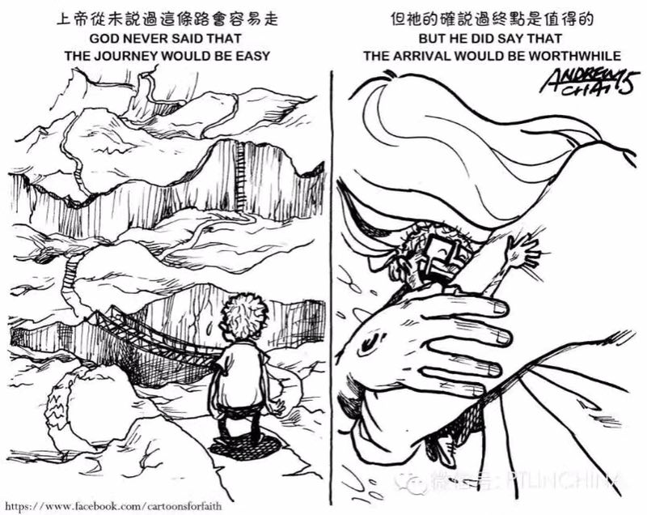

### 同行者灵修笔记

#### 21/1 出3

触动经文：摩西对神说：「我是什么人，竟能去见法老，将以色列人从埃及领出来呢？」神说：「我必与你同在；.....」

因为会经常思考自己的身份而纠结选择，就是因为很多时候凭着自己的力量去做事而忘记自己的安慰是来自于神。

观察：一日，外出放羊的摩西看见异象。神从荆棘火中出来，让摩西带领以色列脱离埃及人的辖制，到流奶与蜜之地。摩西怀疑自己，神安抚摩西，让他明白旨意来自他必成与他。

教训（神是一位怎么样的神？）：慈爱，会心疼自己选民的，时刻看顾着以色列民，会呼召领袖来完成拯救的工作（？是不是人们会忘记神恩才会一而再陷入这样的循环）。安慰者，这时候的摩西对自身以及以色列人都没有信心，但神会让他明白我就是你的神，一直与你同在。

反思：生活中，很多时候想过着基督里的生活，往往不能如愿。有时候像唱片一样，经常反面。

应用：相信神，`时刻`明白他的同在。

祷告：天父，孩子生活中会有不顺服，会抢走主导权，会质疑你和自己的身份，求你帮助孩子明白你和深知你的同在。

#### 22/1 出4

触动经文：摩西对耶和华说：「主啊，我素日不是能言的人，就是从你对仆人说话以后，也是这样，我本是拙口笨舌的。」

同样，在出三中看到摩西会推脱拯救这个工作，但是这里的推脱变得具体，看出了摩西其实还是没有底但是有点想解决问题的态度，可是后面依旧否定了自己看出这里其实更多依旧是逃避拯救工作。

观察：神教摩西三个神迹让以色列人相信摩西，之后摩西依旧犹豫自己是不能将话说明白的人。这时候神对摩西发了第一次怒气，并安排亚伦来帮助摩西的拯救工作。于是，摩西离开岳父那里回到埃及，亚伦迎接他。可是路上神为什么要杀他这件事不是很明白，而他妻子这样的行为却免了击杀也不是很明白。

教训（神是一位怎么样的神？）：有怒气的神，神完全可以控制摩西的想法首先没有这么做，其次，这里发怒并不是摩西不愿意去而发怒，更像是你根本不是很相信我的一种怒气。

反思：神往往愿意使用那些不是很好的人，因为这样才能让更多不足的人明白，神的爱的伟大。可有一个问题是，说我们的神是抬举贫寒人的，那怎么解释相对富裕的人呢？神对摩西说的话，其实更多是安慰摩西，让他真明白我与你同在的。

应用：主权交托吧，更多时候不相信是因为自己会有自己看事情的角度去看自己，从而否定了自己。

祷告：天父，帮助孩子对主权变化的情况变得敏感点，从而更自己到底是凭着什么生活。

#### 23/1 出5-6

触动经文：摩西回到耶和华那里，说：「主啊，你为什么苦待这百姓呢？为什么打发我去呢？自从我去建法老，奉你的名说话，他就苦待这百姓，你一点也没有拯救他们。」

摩西已经去找过法老，却得到不是很顺利的结果。当然他想可能是这一切都是神安排的顺顺利利，可是结果出现问题的时候，他还是会怀疑自己，可以看出这时候的摩西不明白神说的话或者是忘记神之前说会让法老的心刚硬这话。

触动经文：摩西将这话告诉以色列人，只是他们因苦工愁烦，不肯听他的话。

摩西讲拯救的事情告诉以色列人，但是以色列人不听。而我们生活中也是这样，我们会将自己献给劳苦里面，不愿意留出一点点时间与神交流，时间久了会变成道理都懂却不能行的窘境。

观察：摩西和亚伦都去见过法老，跟他说遇见神并且要求法老让以色列民出旷野守节。但法老不认识神，认为以色列民懒惰还有时间去守节，变增大了劳力的难度。以色列人哀求法老得到同样的回复，遇见摩西、亚伦抱怨他们所行的事情。摩西再一次跟主说话为什么是我？怀疑主到底想不想拯救他们。神之后让他明白，他是会拯救的，并且领以色列人出来的就是摩西和亚伦。

教训（神是一位怎么样的神？）：不轻易发怒气的，安慰者。目前为止，神只向摩西发了一次怒气，即使现在摩西还会说自己是一个「拙口笨舌」的人，并怀疑神到底拯不拯救他们，神这时候没有发怒，而安慰摩西他看到了以色列人的处境，我会带领你们出来的。

反思：我们确实会希望神安排好的事情或者祈求的事情是很顺利的，可现实经常不是那么顺利，在那么的一刻会伤心甚至怀疑为什么。接着就是不愿意继续做下去。那么今天的摩西也同样抱怨、质疑，可他还是按照神的指示行了出来，这一点还是要学习的。

应用：即使事情不是那么顺利，依旧要怀着信心继续做下去。

祷告：天父，求你保守孩子的心，在那些失落里同样深信你依旧爱着我，让我还能继续笑着行下去的信心。

#### 24/1 回顾前三天灵修内容

前三那天的都经文都是涉及摩西被神呼召的事情。最多的思考是，被呼召是不是一件很好的事情。如果被呼召的是自己，真的会考虑很多事情，有好多想去做却没有机会去做的事情以及好多事情没有做之类的。那么就涉及到自己是不是一个顺服的人？不是，因为很多时候会凭借自己的能力去解决的，会用自己的方法去衡量是非对错，很多时候对神不是很信靠，心中会有一定的小九九在哪里说话，所以摩西确实是一个榜样，神呼召之后他立刻去做了即使他会有抱怨的时候，可每当要抱怨的时候，他会选择退到神那里与他去诉说自己的不足。那自己也是希望能这样的顺服，愿意摆上自己，可是会被环境、以及环境里的人干扰，觉得怎么要在正值年华时候去过上暮时的生活，还会把真理与生活脱节。昨天看到廖师傅的灵修看到一句「退到神那里，是最好的选择，也是唯一的选择」，很多时候自己愿意去找别人去寻求答案，如果不符合心意可能会换另一个，而从不会认为天父是我们最好的挚友，他明白我的心意，也能满足我的心意。所以，这几天灵修中，更多的感触是要多多思考生活中很多时候与神之间的关系。

#### 25/1 出14

触动经文：摩西对百姓说：「...耶和华必为你们争战，你们只管静默，不要作声。」

很多时候，我们会选择用自己的那一套评判标准去为自己申诉，真的不明白神每一件事情都为着你争战。

观察：神让以色列人过红海，但是再之前还是要安营在海边。神使法老的心刚硬，在来追回以色列民。百姓见法老的兵丁近的时候，开始向神哀求并不相信摩西并发怨言。摩西安抚百姓说「耶和华必为你们争战」。第二天一早开始过红海，神让以色列民走过了海中的旱地而当埃及人下到海后，神使兵丁混乱、使水回流淹没了他们。百姓见神的神迹又信服他和他的仆人摩西。

教训（神是一位怎么样的神？）：全知，感觉并不会一次性将话说完的神。15-18节中，之前摩西就像百姓一样有哀求，这时候才会告诉摩西之后该怎么做。仿佛是操练摩西时时转向他一样。

反思：其实神为什么不让以色列民直接过红海而又要法老来追呢？从事情的经过来看，这时候的百姓的信心不是那么坚定，从后面看见追兵可得，这样做的结果就是让百姓`又`信服他和他的仆人。

看到有一点很重要，摩西也会跟着百姓一样哀求，但是这时候他有一次有了难处转向了神而不是靠自己的才能。

应用：一有难处就转向神    OS：「真的好难」

祈祷：让我时刻明白转向你的重要性，也让我明白更多的时间与你相交。

#### 26/1 出18:1-12

1-2节
【问】是什么让摩西的岳父叶忒罗带着摩西的妻儿来？（提示：连接词“便”）带摩西的妻儿来可能是什么意思？
【我的答】 听见神为摩西和神的百姓以色列所行的一切事，便带着摩西的妻儿来了。信任摩西的这位神。
【我的应用】对神的作为只要有反应的，能看到行动的那种
【我的祷告】天父，帮助我能看见你的作为，让自己有坚定的反应并且能够有所行动，而不是光看而不行

7-8节
【问】叶忒罗来了，摩西是怎么接待的？摩西跟他说了什么？（提示，程度词“都”）

【我的答】 下拜、亲嘴、问安，「将耶和华为以色列的缘故向法老和埃及人所行的一切事，以及路上所遭遇的一切艰难，并耶和华怎样搭救他们，都述说与岳父听」
【我的应用】要热情的招待到我这里的一切人，要乐意去与别人毫无保留的分享主在自己身上的作为分享给别人听
【我的祷告】天父，你明白我会总会去害怕的迈出第一步，求你帮助我每一次都勇敢的走出第一步去而不是看别人的作为而去选择是否分享，让我尽自己的本分去行事。

9-12【问】叶忒罗听见，是什么心情？他是如何称颂神的？他还做了什么？

【我的答】一种喜悦并相信耶和华神的感觉。叶忒罗献燔祭和平安祭给神。
【我的祷告】天父，孩子在家中并不是一个好榜样，求你帮助家中灵里软弱的，让他变得刚强，明白平安与喜乐都是来自与你那里，求你看护保守本家。

#### 27/1 出18:13-27

触动经文：这样，你就轻省些，他们也可以同当此任。

觉得岳父好聪明。回想更多的是团契中，自己会不相信其他同工，怕做不好而自己一人就去出。那问题来我一个人也未必好呢？这时候我一定会很跟别人比较说至少比别人好。

教训（神是一位怎么样的神？）：体贴人的神，「你若这样行，神也这样吩咐你，你就能受得住，这百姓也都平平安安回他们的住处」。一天下来如果只是摩西一个人去审判以及教训和指示百姓，摩西会累死吧。神体贴他，允许他这样做有其余有才能的人帮助他。所以神应该更喜欢一群人去做事吧，毕竟一个人会累会软弱。

反思：为什么自己在团契的时候会选择一个人去做事情呢？更多会去考虑事情而不是人，会怕事情做不好而丢面子吗？还是就是偏执呢？我觉得都有吧。可这样确实会很累，更多还是要相信。

应用：找好自己的定位，不要像消防员一样那里起火就往那里钻。

祈祷：天父，安抚孩子的内心，让孩子真的明白成事是在于你，也求你帮助孩子一直都会积极的与人分享，让自己按下性子来，侍工的时候更多看重的是人而不是做好这件事情。

#### 28/1 回顾前三天灵修内容

我確實會有兩種不一樣的面孔：大學生活、團契生活。分別在不同的環境下，自己會有不一樣的心思意念，確實會存在很多的小九九。別人得罪了自己一定會很較真，無論是非對錯。可，我深知不應該這樣，每次營會結束我才發現自己會有克制一段時間，之後會覺得很累有變回老樣子了。但，總結這三天的經文來說，神是我的幫助者，為什麼我總要去跟別人較真呢？我會有吃虧以及不甘心不願意示弱在我裏面，但神是我唯一的依靠和幫助，說實話生活中我會去憑藉己力去行事，一方面因為我是怕麻煩別人的人甚至怕麻煩神，而二方面為爭一口氣在裏面。

祈禱：天父，求你安撫孩子的内心，幫助孩子將自己的主權能夠正真的擺上、無時無刻的擺上，讓自己有機會以及心思意念去思考你與我同在這件事，讓我有寬恕的心，讓我不要與他人一味的爭強。

我還是一個不原意去相信別人的呢！解釋一下，我是會怕交待給別人的事情做不好，為什麼怕？這人在我影響中留下不好的形象。所以這種情況下，我一般都會同時準備一個B計畫來彌補事情突發狀況。因為上面的原因，長此以往就都準備補救計畫，會對很多人包括團契中的DXJM有時候會不耐心，而更多願意一個人去做。可，神的心意告訴我確實他不願意一個人去撐起整個侍工，況且一個人有限的會有自己不自信的時候，所以會有亞倫去幫助摩西。

祈禱：天父，求你幫助還孩子放下自己的己見，不要有驕傲的心、傲慢的嘴，讓還孩子樂意與別人交流，會同心的分享給別人神在我身上走過的痕跡。

#### 29/1 民11:4-17

觸動經文：他們中間的閑雜人大起貪欲的心......

經文是出現在走曠野、吃嗎哪的時候，人會不只是滿足於現有的嗎哪，此處也描述了很多種嗎哪的做法，可中間總會有「閑雜人」對這樣的生活不滿足。為什麼是閑雜人大起貪欲？會比較，跟以前埃及的生活以及現有的生活比較，從而覺得為什麼現在要遭這份罪呢！映射到我的生活，其實也是一樣的，平時很忙會沒有時間去考慮很多感受，當自己閑下來思考的時候，可能就因為無聊就開始比較自己與別人的差距等，這時候就會很不甘心而引發部分的貪心說我一定要做到，從而陷入下一輪的忙碌。

觸動經文：....他們就和你同當這管百姓的重任，免得你獨自擔當。

神會體貼人的軟弱。這裡的有一個問題：神知道摩西一人承受不來，為什麼不提早就這樣安排讓摩西少點負擔呢？

觸動經文：民11:12

在主日學帶孩子的時候，我才發現自己越來越愛管「閒事」。很多初中的孩子動不動就打架什麼，以前我都是直接解決的，現在我和他們一起去思考怎麼回事以及事情的結果會是什麼了？其實很多時候，我也不想的畢竟一天下來很累，可是總會有那樣的心思在哪裡說時間不多了，還是挺挺教教他們吧。

教训（神是一位怎么样的神？）：體貼的神，這裡摩西同樣會抱怨一人承受不來，神這裡是直接對摩西找70個幫手一同擋這個重任。

反思：為什麼會總會其貪心這個念頭？就是不滿足與現狀，很多時候被別人說你好有「上進心」，好像其實「上進心」算是「貪心」的前身吧，當自己要變態到折磨自己去爭取世上的各種名獲利的時候，這時候「上進心」已經進化為「貪心」。那為什麼我們會不滿足與現狀呢？攀比、奮鬥的理由...，自己會比較不同時間段的自己，以及更多厲害的人物，並且現在的社會比你小的人都比你厲害的時候，自己會有一些焦慮在裏面，覺得不努力真的太差勁了...但這一切的焦點都是在整個世界上了，並沒有向摩西一樣有困難轉向神，好像忘記了自己的誰。

应用：感覺到有情欲的時候就要轉向神，明白自己在基督裏的價值，不要被世界影響太長了。

祈禱：天父，求你讓孩子明白自己的軟弱，不要讓自己一人去逞強的承擔，安撫孩子內心，讓我深知你會為我預備最適合我的道路，求你讓我堅信下去。

#### 30/1 民11:18-35

24-26节：疑惑的地方是「他們就受感說話，以後卻沒有再說」，為什麼靈停在他們身上之後卻沒有再說話？可是營中的「伊利达」和「米达」没有去会幕前却可以有灵停在他们身上。并且说这两人都是被录的人，但没有去，可不是说有70人了吗？

反思：之后没有再说这件事情，是信心的问题吗？但作为长老的70人也会有这样的问题，更何况那些闲下有贪欲之心的人呢？让我能想到的一件事情就是，信心确实很难坚固的，可走这条路的必备的条件也就是信心了。

祈祷：天父，求你赐给孩子一颗明白真理，相信真理的心，不要让我凭着自己的感受去衡量这个信仰跟我之间的关系。让我能更多去思想你。

18-20、32-33节：不是说好让以色列人吃一个月的肉吗？让他们吃到吐吗？但是，之后却发生了变故，神直接用「最重的灾殃击杀了他们」，这到底又为什么呢？并且感觉这一次有很多人死掉。他们死于自己的贪欲，突然感觉这件事情有点恐怖了，因为自己生活中也会抱怨一些事情那我也会不会有这样的结局呢？

反思：以色列人生活改变过后接受不了开始埋怨神的为什么引他们出去！让我想的更多的是：应该是顺服神的安排，可是说的真的好容易，当事情临到我的时候，说实话我不一定能顺服下来。

祈祷：天父，很抱歉孩子会较真与自己的选择，会走很多弯路，你也晓得孩子的性格，请你安抚孩子的心灵，不要太较真自己的事情，也不要老想着该自己该怎么做才能少走弯路，孩子愿意顺服在你的宝座旁，也愿意将自己自己的主权完全交托与你，求你帮助我，求圣灵在我心中做工，使我愿意的意思能够渐渐的行出来，阿门。

此刻状态：有点疲惫。

#### 31/1 民12 补

触动经文：...「难道耶和华单于摩西说话，不也与我们说话吗？」.....

反思：这里是米利暗因为摩西娶了古实女子毁谤摩西说的话，这里的有一个大前提是他们是姐弟关系都会有毁谤自己兄弟的情况，更何况我们？平时生活中，我们也会因一些自己不接受的事情，去背后议论DXJM。

祈祷：天父，看顾孩子的心思意念，帮助孩子去做一个和睦DXJM的人而不是离散的人。孩子也会有不接受的时候，但求你让我明白每一人的一言一行都是出于你的安排，让孩子有心去接纳自己和身边每一个人的不足，使我明白出于爱也成全于爱。

教训（神是一位怎么样的神？）：教导孩子彼此相爱、使人和睦的神（虽然直接让米利暗立即得大麻风现在在我看来是不是有点严酷）。耶和华不允许只对摩西说话这件事情而嫉妒诽谤摩西，却忘记摩西是尽忠的。

反思：细想为什么会这样？经文说道摩西娶妻这件事情，但从话语中看出仅仅是神对摩西是直接说话而不用谜语之类的。更多是出于嫉妒，因为米利暗他们接受的想必就是谜语。时间久了，大家会忘记摩西前期是多么的辛苦、多么的挣扎，曾经也是会抱怨、推托这件事情，但是他每一次都是选择是转向神和祈求神。所以大家时间久了很容易让我们忘记一些本不应该忘记的事情，所以为什么在约书亚记中过河要立石为记。好像就是因为前因，我们很容易产生不公平、不甘心之类的情绪。

祈祷：天父，孩子更多时候有情绪的出来的时候，我会忘记耶稣早已为我这样的死这件事情，会忘记你是多么爱我这一件事情，求你帮助我牢记你每一日在我身上的恩典和同在，也让孩子让其他DXJM看到时，让他也同时明白你是多么的宝贵，你是多么的爱他，阿门。

此刻状态：清醒、Happy，因为刷了昨晚留下的知乎，这是第一次补的灵修所以多少心里会有一点点内疚，😄哈哈，希望以后会没有这点点的内疚。

#### 01/2 回顾前三天的灵修

💡其实有一个疑问：为什么闲杂人会起贪欲这件事情？不会就因为「太闲」吧😪

其实回顾一次灵修内容，我发现神还是蛮严厉的。确实以色列人会时不时抱怨神，每一次神都会派摩西说话。可是为什么这几次就要惩罚？在我的观点是「想必他老人家也忍了好久，为什么你们不能像你们列祖亚伯拉罕一样呢？」

回想到自己，那一刻会有一丝的惧怕。我这么逞强，我这么每次被逼的走投无路才来想到你，你会不会也忍我了好久呀😰，会不会那一天我惹怒了你，也会被除去。

「一个人能都很快，却不能走远」，就像歌唱的一样，确实很难走，为什么小时候并不会觉得呢？其实，神也想到这事，也不选择让这重担让摩西一人承受。很多时候，我会看不上其他人，觉得自己很OK的，可是去年一年让我回顾的时候，我一个人的时候会很情绪化，久了会有厌恶他人的情绪出来，所以「立杰呀，不要再一个人了」

我记得廖师傅那一天有这样一个问题「身边有些含金汤匙出生的DXJM，你会祝福他们吗？」会祝福，但我同时会有抱怨或是嫉妒出来的，这时候还真分不清是那一个亦或者两个都有。让我想到就是「伊利达」和「米达」，没有去会幕但仍旧说语言，这时候约书亚会嫉妒，可摩西却是「开心」的，他希望每一个人将这份重担都落在心中。

祈祷：天父，你看顾孩子在地上的生活，让孩子能有足够的耐心在你里面，让我能放开自己，接纳自己的不足，时刻明白你早已肯定了我。

此刻状态：😄，终于没有去拜年了，开始放寒假咯！、

#### 02/2 民14:1-10

触动经文：众人彼此说「我们不如立一个首领，回埃及去吧！」

反思：因为前面有12探子的来报，让以色列人有一次陷入了慌张，开始害怕迦南人是实力从而再次追溯抱怨自己为什么出来！仿佛有了一个套路，遇见不爽的事情——>埋怨领袖——>埋怨神——>为什么要出埃及。是不是这样就说明还是那个问题，人是太容易忘记恩典的，太容易在患难中跌倒的呢？

但这句话，感觉说明，这时候的人不再希望是神召领袖来管制他们，他们更希望是自己选出来的领袖。这样可以说明其实大多数人还是信赖神吗？

祈祷：天父，求你帮助孩子看顾自己的心思，让我能相信你是为我着想的。帮助孩子有静下心的那一刻。

触动经文：...耶和华若喜悦我们，就必将我们领进那地，把地赐给我们...但你们不可背叛耶和华，也不要怕那地的居民，...并且荫庇他们的已经离开他们，耶和华与我们同在，不要怕他们

反思：总会有清醒的人会勉励大家。可有一个问题是：怎么看待这里的「背叛」？他们抱怨好像不算是背叛，所以神不是那么严格到你一抱怨我就不认你，他仿佛知道人抱怨是常态，更看重的是你是怎么样的一个人吧而不会因为你那一刻怎么想而轻看或者不认了你。可我生活中，我就是会因为别人的一刻的言辞或行为而看不起了别人😪。

祈祷：天父，帮助孩子能不凭自己的眼界去论断别人，让孩子学会去接纳更多的东西，教导孩子的品性，让捋顺它。

此刻状态：😞，今天玩了一天的王者荣耀，原本想coding的这件事情都一直拖延。

#### 03/2 民14:11-25

触动经文：...求你照你的大慈爱赦免这百姓的罪孽，好像你从埃及到如今常赦免他们一样..

反思：百姓是不是抱怨，而摩西从埃及阶段也有跟着抱怨，但是现今的他明白了，开始为着这些无知百姓向神祈求赦免。跨过千年后的耶稣也同样为全人类向神祈求。这里看到了一个领袖的成长，也看到神愤怒的样子😰。

祈祷：天父，孩子会有不明白真理的时候，会有对你的话质疑背叛的时候，甚至会有惹怒你的时候，我知道这样是不对的，求你赦免我，帮我更爱你。

触动经文：

..这百姓要藐视我要到几时呢？我在他们中间行了这一切神迹，他们还不信我要到几时呢？...

..这些人虽看见我的荣耀和我在埃及与旷野所行的神迹，仍然试探我这十次，不听从我的话，他们断不得看见我向他们祖宗所起誓应许之地。凡藐视我的，一个也不得看见...

教训（神是一位怎么样的神？）：爱人、严厉的神。这时候看到神会有怒气出来，因为都给百姓看到了一次有一次的神迹，而很多百姓会忘记，并且会有贪心出来；更多的时候应该把神当作了获取的工具，可更严重的时候，百姓连求都不求，就干抱怨看神会不会给的心态。

神一次又一次的行神迹，让百姓信靠Ta是神，白天云柱夜间火柱的庇护他们，他们却一而再，再而三的试探神，最后神还是不愿意让这一批原本能及早到达的迦南的进去。

反思：我有没有把神当作了工具亦或者是爱理不理，要神理我呢？有，因为自己是很要强的人，即使是神很多时候一不小心就成了自己的 奴仆了🙈，甚至有时候会去抱怨😰。

祈求：天父，孩子明白这一些是罪，求你赦免，让我能渐渐明白你的话，让我能够牢记你的恩典，看顾孩子的每一天的光阴。

此刻心情：😄，今晚终于coding了，即使半天没做出啥来，至少少玩了王者荣耀！

#### 04/2 出32

触动经文：亚伦从`他们`手里接过来，铸了一只牛犊，用雕刻的器具作成。`他们`就说：「以色列啊，这是领你出埃及地的神。」

反思：`他们`是谁？第一个是以色列百姓，第二个我原想是亚伦这班造牛犊的人，但5节「亚伦看见，就在牛犊面前驻坛」，这里的他们也该是以色列百姓。这里其实看到一点心酸，以色列百姓从埃及到旷野经历了这么多，仍旧不认识神，铸了一个金牛犊就在哪里当作拯救他们的神。有个问题出来：在经历很多神的保守，有没有却给自己立假神在哪里拜，还安慰自己说这就是一直保守自己的神？

会有吧，这种情况自己应该是很软弱的时候，会去凭着眼界去思考事情。而这里的百姓会不会因为有段时间没有人带领他们与神相交，而选择这样做呢。经文中只能说明摩西去了西奈山40天，而百姓因为摩西的不归而选择这样做。

祈求：天父，求你帮助孩子的软弱，帮助孩子长时间一个人的时候，也不要忘记你的同在，让自己花精力与你相交，看顾那些孤身软弱的DXJM，让他们也明白你看顾他们。

触动经文：耶和华对摩西说：「谁得罪我，我就从我的册上涂抹岁的名，..我的使者必在你前面引路...只是我追讨的日子，我必追讨他们的罪。」

教训（神是一位怎么样的神？）：严厉、慈爱的神，神都有怒气了因摩西的祈求也没有除去百姓，但说了一句蛮重的话，即使百姓都惹怒了神，但神仍旧让他的使者在百姓前面引路，神仍旧还是会看顾这一群百姓。让我想到「上帝未死1」中痴呆的夫人对儿子说的那些话：「有时候，魔鬼允许人们无忧无虑的生活。是因为它不希望人们转向神。你的罪像牢房 除此之外都很美好、舒适，而且似乎没有任何必要离开。大门敞开的，有一天时候将到，窄们猛一关，突然..为时已晚。」

祈求：天父，赦免孩子的罪，孩子还是会有很多小九九，可能会因为想太多而去怀疑你，求你让孩子能日渐的明白你，求你看顾孩子在世每一天都能察觉到你的同在。

一个小问题：摩西去求神不要除去以色列人了，为什么自己还要带领利未人去杀人呢？

#### 05/2 回顾前三天的灵修

即使见过神迹、见过神荣光的以色列百姓，在难处、孤身时候都会软弱。这告诉了我，软弱其实才是人生的常态，但是常态中也要保持着这份信心。那么如何保持这份信心呢？经文中的例子🌰是要有一个属灵领袖。但是我怎么感觉这次回顾的感觉和上一次总结一样，会有担心😰在里面。回想自己确实经常陷在情绪当中，不知道为什么那时候会呆在情绪当中而不是选择转向神。

祈求：天父，帮助还自己时常想着你的话语，让孩子不要想太多😩，像孩子一样在你面前，阿门。

此刻状态：😕，不知道该怎么描述了。这时候的表情。

#### 06/2 民16

触动经文：摩西有对可拉说：「利未的子孙哪，你们听我说：以色列的神从以色列会中将你们分别出来，使你们亲近，办耶和华帐幕的事，并站在会众面前替他们当差。耶和华又使你和你一切弟兄利未的子孙一同亲近他，这岂是小事？你们还要求祭司的 职任吗？...」

反思：人会有贪心，这份的贪欲如果真的不明白满足来自于神的话，在每一个阶段都会有贪心出来。可拉是被选入会中的一人，有了一定的名望，并且还是利未人办理耶和华帐幕事的人。仿佛就是不满足，看到上头还有领袖的时候，召集他人一同攻击领袖。便有一个问题：「你会贪心？那现在呢？该怎么去做？」我会，`因为觉得年轻所以会将这份贪心转为上进心当作向上的动力`，现在可能我还是会有贪心在里面，可我真想无时无刻的明白圣经的话语晓得在神面前早已经得到了满足。可是每一次都是事后才意识到自己这一刻贪心了。很多时候，真的只会看着眼前的好处而不去辨别自己是否贪心了。突然觉得，自己这么差劲的人，神却依旧爱我，明明应该很开心的事情，自己去却很伤心。

教训（神是一位怎么样的神？）：公义的神，百姓真的这样了，神真的不止一两次有要击杀这一切百姓的的怒气了。

反思：即使百姓攻击摩西和亚伦，神要击杀百姓，他们没有攻击别人，反而在祈求神饶恕他们，为他们赎罪。

祈求：让孩子不要太逼自己那么上进，让孩子及心甘乐意的将自己的主权交托在你的手中，安抚孩子的性子，不要伤害到身边亲近的人，保守孩子的心。

问题：为什么人们会这样？难道就因为始祖的犯罪，罪就入了世界，让人心会不断的变化。都不敢想神起初造的人们是多么好的样子。

#### 07/2 民21:4-9

触动经文：百姓到摩西那里说：「我们怨 讟耶和华和你，有罪了，求你祷告耶和华叫这些蛇离开我们。」

反思：`百姓`之前却是会抱怨这一切的环境不好，以前的他们一直抱怨，但是这次他们遭到苦难的时候，他们开始意识到自己之前的行为了，他们主动的到摩西那里，让摩西帮他们祷告神。这一转变真的感动吧。摩西看到百姓这样的回转应该会很开心吧。感恩那些一直都相信着自己的人，他们始终相信你会回转回来，即使时间很长。

祈求：天父，不要刚硬孩子对别人的心，孩子真的会很容易不给别人第二次机会，可是我这么差劲的时候，你都时刻等着我回转的那一天，我知道这样会很难，自己会挣扎，可孩子真的很容易去慢慢放开自己执念，接纳别人的不足，求你看顾我阿门。

